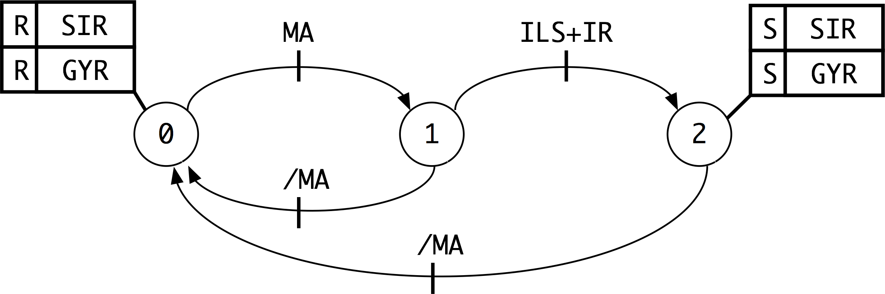

# Projet d'alarme d'habitation simpliste gérée par MAE

## Description des entrées et sorties
Projet d'alarme d'habitation comportant trois entrées TOR sous forme de capteurs :
* Infra-rouge (IR),
* Contact de porte type Reed (ILS)
* Interrupeteur d'armement/désarmement (MA)

Deux actionneurs TOR :
* Une  sirène (SIR)
* Un gyrophare (GYR)

## Fonctionnement
Le fonctionnement est le suivant : Une fois l'alarme armée MA à "1", le passage à "1" de IR ou ILS provoque le passage à "1" de SIR et GYR restant actif jusqu'au retour à "0" de MA. Le système fonctionne grâce à une machine à états avec actions de type actions de mise à zéro explicites (AMZE).
toto.
##Machine à états

---
 Projet d'alarme d'habitation simpliste gérée par MAE de Joris Serrand est mis à disposition selon les termes de la <a rel="license" href="http://creativecommons.org/licenses/by-sa/4.0/">licence Creative Commons Attribution -  Partage dans les Mêmes Conditions 4.0 International</a>.
